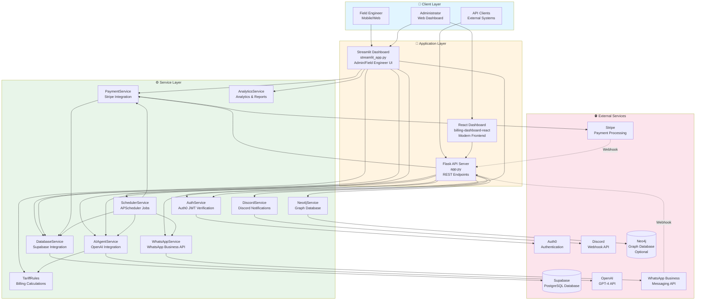
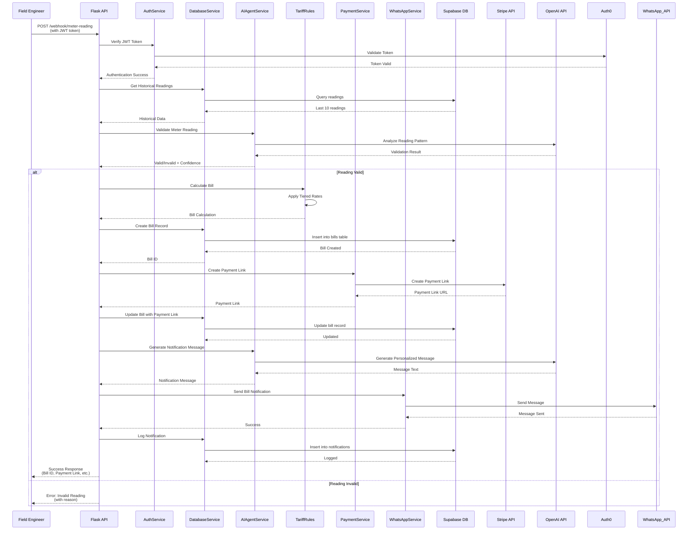
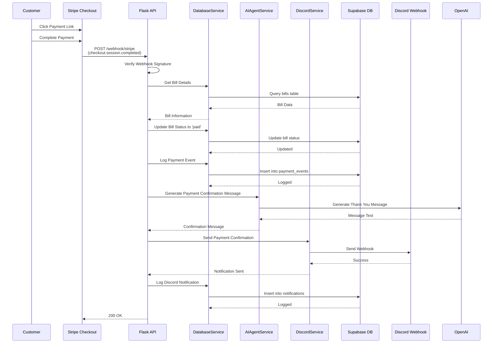
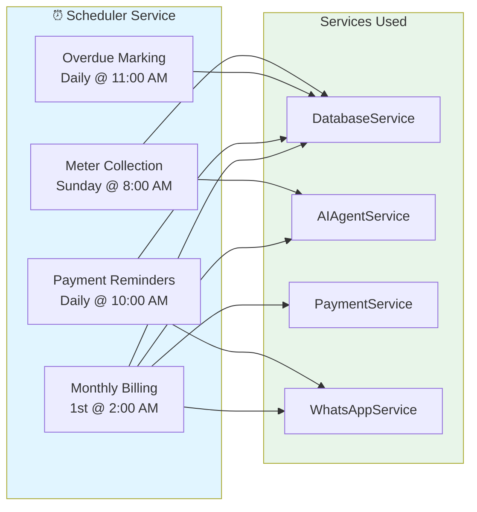
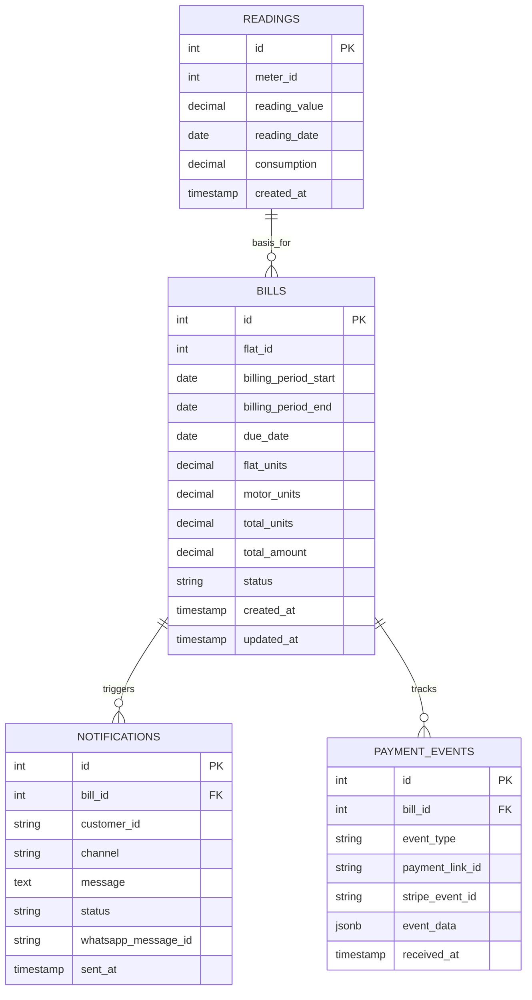
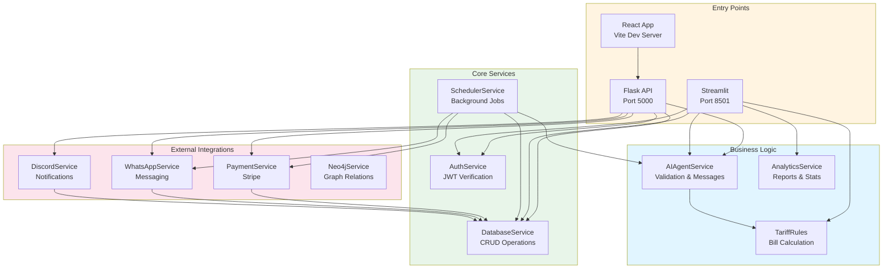
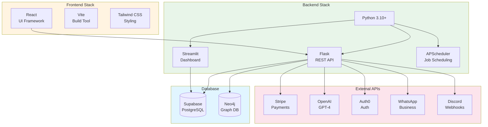
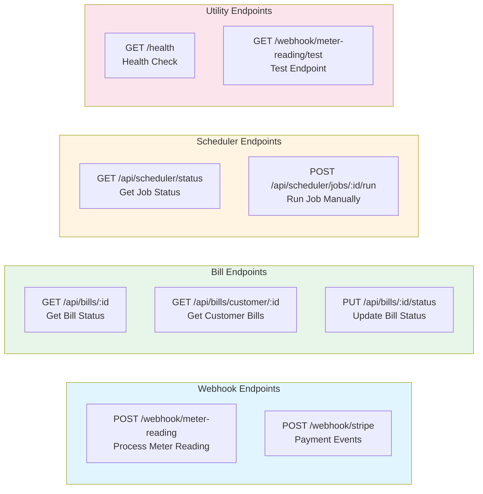

# Electricity Billing System - Architecture Diagram

This document contains mermaid diagrams visualizing the complete architecture of the Electricity Billing Automation System.

> Current implementation note:
> - The Streamlit app (`streamlit_app.py`) is the primary UI and calls `DatabaseService` directly in **Supabase REST mode**.
> - The Flask API (`app.py`) is optional (primarily for webhooks / integrations).
> - In Supabase mode, readings live in the `readings` table (not `meter_readings`).

## System Architecture Overview

## Meter Reading to Bill Generation Workflow

## Payment Processing Workflow

## Scheduled Jobs Architecture

## Database Schema Relationships

## Component Interaction Map

## Technology Stack

## API Endpoints Overview

---

## Notes

- **Neo4j** is optional and used for relationship tracking
- **WhatsApp** can run in mock mode if not configured
- **Stripe webhook** signature verification can be disabled in test mode
- All services include retry logic and error handling
- Logging is handled via `utils/logger.py` with rotating file handlers
- Configuration is managed through `config.py` using environment variables

