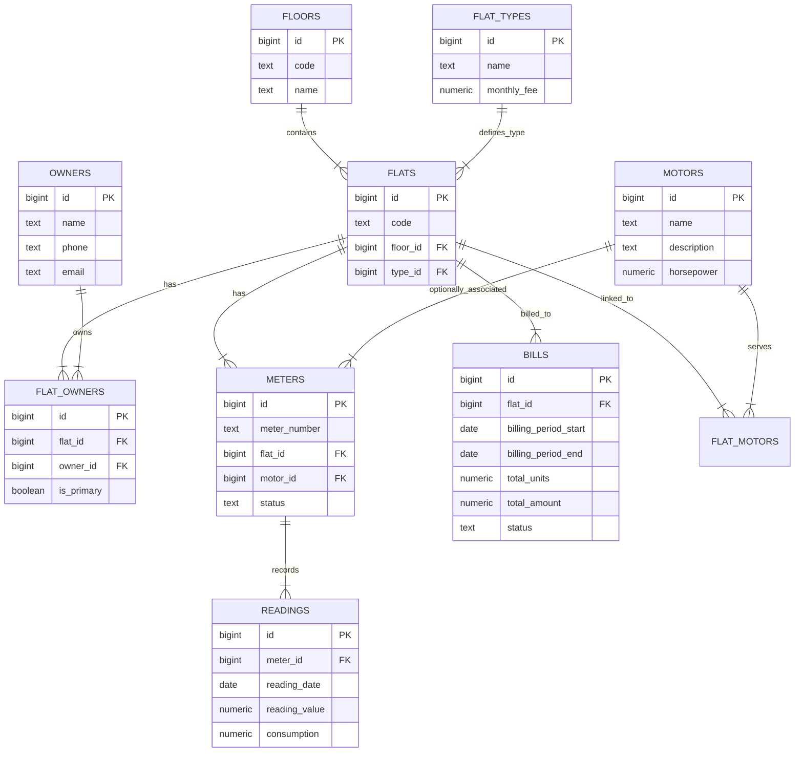

# Blessings City Electric - Database Schema (Current Implementation)

This document describes the **normalized Supabase schema** used by the Streamlit app and Python services in Supabase REST mode.

Source of truth: `database/supabase_schema.sql`

## Entity Relationship Diagram (ERD)

The following diagram illustrates the high-level relationships between the tables in the database.

## Detailed Table Descriptions

### 1. Infrastructure Core
These tables define the physical structure of the property.

#### **floors**
Represents the floors within blocks.
- **id**: Unique identifier.
- **code**: Short code for the floor (e.g., "G", "1", "2").
- **name**: Display name (e.g., "Ground Floor", "First Floor").

#### **flat_types**
Categorizes flats (e.g., 2BHK, 3BHK, Penthouse).
- **id**: Unique identifier.
- **name**: Type name.
- **monthly_fee**: Base monthly maintenance or service fee associated with this flat type.

#### **flats**
The central entity representing individual residential units.
- **id**: Unique identifier.
- **code**: Unit number (e.g., "A-101").
- **block_id**: Foreign key to `blocks`.
- **floor_id**: Foreign key to `floors`.
- **type_id**: Foreign key to `flat_types`.

---

### 2. People & Occupancy
Tables managing who owns and lives in the flats.

#### **owners**
Property owners.
- **id**: Unique identifier.
- **name**: Full name.
- **phone**: Contact number.
- **email**: Email address.

#### **flat_owners**
Link table between Flats and Owners (Many-to-Many).
- **flat_id**: Link to the flat.
- **owner_id**: Link to the owner.
- **is_primary**: Flag to indicate if this is the primary contact owner.

Note: the current schema focuses on owners/primary contacts. Tenant/tenancy tracking is not part of the current Supabase schema.

---

### 3. Utilities & Metering
Manages electricity tracking for flats and shared motors.

#### **motors**
Shared or dedicated electric motors (e.g., water pumps).
- **id**: Unique identifier.
- **name**: Friendly name (e.g., "Block A Water Pump").
- **horsepower**: Capacity specs.

#### **flat_motors**
Associates flats with motors they depend on (likely for shared cost calculation).
- **flat_id**: Beneficiary flat.
- **motor_id**: The motor.

#### **meters**
Physical electricity meters.
- **id**: Unique identifier.
- **serial_number**: Hardware ID.
- **flat_id**: The flat this meter monitors.
- **motor_id**: If this meter monitors a motor instead of a flat.

#### **readings**
Periodic meter readings.
- **id**: Unique identifier.
- **meter_id**: Link to the meter being read.
- **reading_date**: Date of reading.
- **reading_value**: The raw number on the meter.
- **consumption**: Calculated units consumed since the last reading.

---

### 4. Billing & Finance
Handles costs and payments.

#### **bills**
Generated bills for flats.
- **id**: Unique identifier.
- **flat_id**: The flat being billed.
- **tenant_id**: The tenant responsible (nullable).
- **billing_period_start** / **end**: Coverage dates.
- **flat_reading_id**: Reference to the specific reading used for this bill.
- **flat_units**: Electricity units consumed by the flat.
- **motor_reading_id**: Reference to motor reading (if applicable).
- **motor_units**: Share of motor units (if applicable).
- **water_motor_share**: Cost share for water/motor usage.
- **total_units**: Sum of flat and motor units.
- **total_amount**: Total currency amount due.
- **status**: Payment status (e.g., 'pending', 'paid').

Note: payment activity is tracked via `payment_events` (Stripe webhook audit log) and `bills.status`.

## Key Workflows Inferred
1.  **Meter Reading**: A new row is added to `readings` linked to a `meter`. The `consumption` is calculated based on the previous reading.
2.  **Bill Generation**: A `bill` is created for a `flat` using the latest `reading`. It likely aggregates `flat_units` (direct) + `motor_units` (shared via `flat_motors` logic).
3.  **Payment**: Residents pay, creating a `payment` record updating the `bills.status`.
